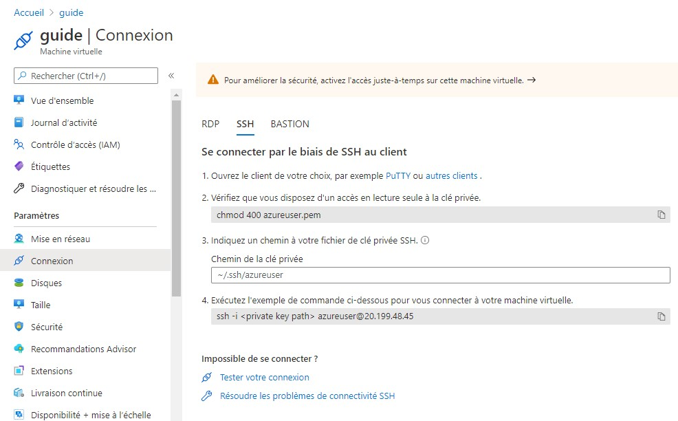

# Microsoft Azure and virtual machine Guide

> This is a quick introduction and guide on how to deploy a virtual machine on a cloud service like Azure. Also geared toward student at LDV.

## Create an account

First go to this url <https://azure.microsoft.com/fr-fr/free/students/>.

If you don't have an account, create one by clicking on "Activer maintenant". Follow the step asks and create an account with your devinci mail.

After creating your account, log in to Azure. The default page should look like this :


There is a lot of services on Azure Education and I will not talk about them as it's not the subject of this guide. But do know that you can also download some free software like Visual Studio Professional, Visio, Windows 10 Education ...

## Virtual Machine

In the search bar, type "Machines virtuelles" if site is in French or "Virtual machine" in English and click on the result.

The page should look like this :


As you can see I already have a machine launched. I will show you how to create, setup and connect to a new virtual machine.

Too add a new virtual machine : "Ajouter" > "Machine virtuelle".

You will get this :


We will keep most case to its default settings.

Case that need modification or filling :

- Groupe de Ressource : Create a new one or put an existing group. Name it as you wish
- Nom de la machine virtuelle : Put a name for the VM
- Region : Choose what's nearest to where you live and what your server to be
- Image : default should be set to Ubentu Server
- Taille : Set the size of the VM that you need, the higher performance you choose to more expensive it will be. The cheapest VM is **Standard_B1ls**, choose this first for this tutorial.
- Nom d'utilisiteur : Name of admin user in the VM. Put whatever you want but do not forget it. I put **azureuser**
- Type d'authentification : Generate new SSH key
- Nom de la paire de clé : Give the key a name, I put **azure**

This much configuration is enough. You can tune it more with the other tabs ("Disques", "Mise en réseau" ...).

Click "Vérifier + Créer"

Check if the config is good for your use. Then click on "Créer"

A pop-up wil appear about the new key you generated to access the VM. Download it and do not ever delete it on your computer. At least make a copy of it and put it somewhere safe. You will only able to download it this once, and it will be the only way to access you Virtual Machine.

If you named it like me, the downloaded file should be calle "azure.pem".

Now the machine should be launching. Wait a while till the machine is running.

You should get this if the VM has been successfully launched :


Click on "Accéder à la ressource" for more information about the machine currently running.

You should get this :


Now it's time to connect to the Machine.

There is a guide on how to connect to SSH on the site. Click on "Connexion" and you should have this :



We will connect with SSH. If you are on Windows you will need to use Putty. You'll need to check this tutorial to do it on [Windows with Putty](https://docs.microsoft.com/en-us/azure/virtual-machines/linux/ssh-from-windows).

I'm using a linux environment so the following will be on how to connect to it with Linux. To be more precise I'm using [WSL 2](https://en.wikipedia.org/wiki/Windows_Subsystem_for_Linux).

Youtube video on how to install WSL2 if you want : [BEST Web Dev Setup? Windows & Linux at the same time (WSL)](https://youtu.be/-atblwgc63E)

On a linux console, go to the directory "~/.ssh" with this command :

```text
cd ~/.ssh
```

Copy the key (azure.pem) you downloaded to this folder. You can do it like this :

```text
cp "Source to file" ~/.ssh
```

Replace "Source to file" with the path of where azure.pem is stored. For me the source path is : /mnt/c/Users/david/Downloads/azure.pem

Now that the file is copied, You have to change the permission of it. Use the command :

```text
chmod 400 azure.pem
```

Now to connect to the remote server with ssh, here is the command :

```text
ssh -i "azure.pem" azureuser@20.199.48.45
```

Change "azure.pem" the your ssh key. azureuser is the name I gave, change it if you didn't use the same. And you can find the IP in your VM info.

Or you can copy paste the command in "Connexion" tab, the last bloc as you can see in the last screenshot. Every information is already correct, you just need to put the key name.

If it's the first time you log in, it'll ask you if you trust the source etc. Type yes. You are now connected to your remote machine.

## Run a UDP server on the VM

Now that you have access to the VM on the cloud, we will do a quick exercice on how to create a Node UDP Server that will received UDP message.

First install NodeJs on the remote machine, run these command :

```text
sudo apt update
sudo apt ugrade
sudo apt install nodejs
```

Now Node should be installed on the machine. [NodeJS](https://en.wikipedia.org/wiki/Node.js) is a run time environment of Javascript.

Two option to make the file with the JS code :

1. Copy udp.js file in this git repository directly to the remote server. You can do it with this command, back to your own machine and still in "~/.ssh" directory :

   ```text
   scp -i azure.pem /mnt/f/Document/VED_Ether/udp.js azureuser@20.199.48.45:~/
   ```

   For me, the command will look like this. Path to the local file first and at the end path for remote folder.

2. On the remote server, create a new file and copy the code. To create a file and directly add text within, we will use Nano as our text editor :

   ```text
   nano udp.js
   ```

   Then copy paste the code below while in the editor (Ctrl+C/Ctrl+V) :

   ```js
   const dgram = require("dgram");
   const server = dgram.createSocket("udp4");

   const port = 55151; // Port that server will be listening on

   server.on("error", (err) => {
     console.log(`server error:\n${err.stack}`);
     server.close();
   });

   server.on("message", (msg, rinfo) => {
     console.log(`server got: ${msg} from ${rinfo.address}:${rinfo.port}`);
   });

   server.on("listening", () => {
     const address = server.address();
     console.log(`server listening ${address.address}:${address.port}`);
   });

   server.bind(port);
   ```

   Now to save and exit, do Ctrl+X > Y > Enter. (^ = Ctrl touch). You can check the content of the file with : "cat udp.js"

That's the 2 way we can add our code, let's now run the code with the following command on the remote server :

```text
node udp.js
```

Your server should be running fine now, a message telling you on which port it's running on should show too. Don't quit this console as it will print every message that will be received. But if you try to send a message to it right now it won't work, we still need to configure our server in Azure so that it will allow message from different port.

If you look at the code, we use port 55151 as the entry point to our UPD server. Keep that in mind, it's the port that we need to add in Azure configuration.

So back to Azure website, on our virtual machine, go to "Mise en réseau".


Click "Ajouter une règle", a pop up will show. Let everything to what's defalut in it except thse :

- Plages de ports de destination : 55151 (the port we put on the code)
- Protocole : UDP
- Nom : upd_server (name it as you wish)

And you can add a description in it. Click "Ajouter". Now a new port rule will be added and you can finally listen to message sent on the UDP server.

Let's try to sent a message now. We will use [Hercules](https://www.hw-group.com/product-version/hercules) to sent a message to the server. If you don't have it, download the latest version.

In Hercules, go to _UDP_ tab, in UDP bloc, for "Module IP", fill in your VM IP adresse (same as the one used to connect with SSH), for the port put 55151, and local port can be anything, just let default if it has. Click "Listen".

To send a message now, in the box below, put your message and click "Send". You should received it on your remote server console now.


To quit the node application on the remote server, use Ctrl+C.

There is one problem with this node server, it's the fact that if you quit from the SSH console, the node application will shut down too.

So now I'll show you how to run an application in the background, so that even if you leave the ssh shell, the program is still running.

The command is simple to put it as a background prgram :

```text
node udp.js &
disown
```

The program should be running on the background now, you can safely leave the shell. Also keep note of the PID given of the program, in case you later need to kill it.

This is the end of this guide on how to setup a UDP server on Microsoft Azure.

## Go deeper

I'll leave here some ressource if you want to go deeper and truly understand everything I did.

- More on Cloud Service with this course on AWS, it works the same as Azure and if you understand how to do it on AWS, it's pretty much the same on Microsoft Azure : <https://openclassrooms.com/fr/courses/4810836-decouvrez-le-cloud-avec-amazon-web-services>
- A course on how to use Linux : <https://openclassrooms.com/fr/courses/43538-reprenez-le-controle-a-laide-de-linux>
